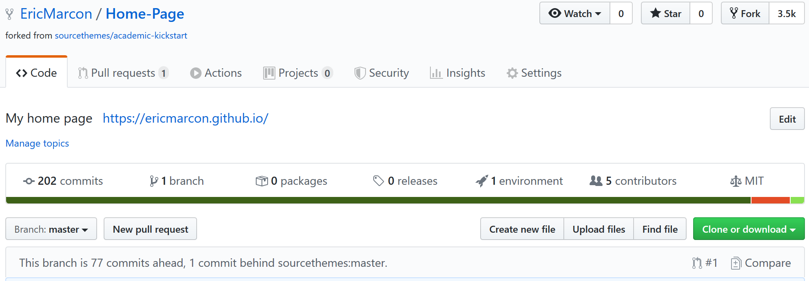
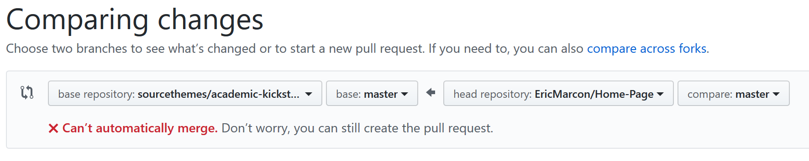
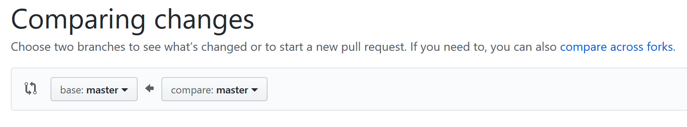
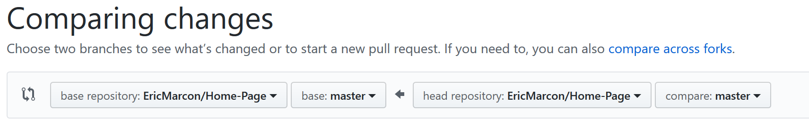
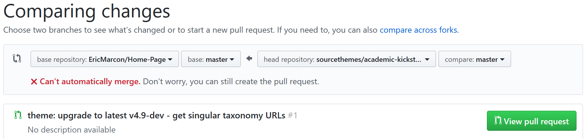
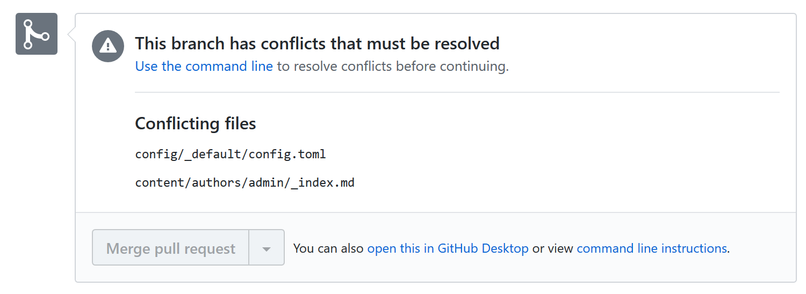
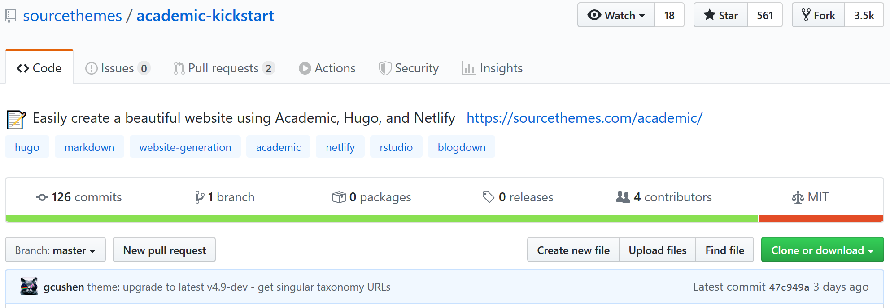

Ce site est généré par `blogdown` sous R, avec le thème Academic pour Hugo.

**La documentation suivante est valide pour les versions d'Academic antérieures à septembre 2020.**

Le version en cours ne nécessite plus de mise à jour du thème par Git mais installe une version à jour à chaque compilation avec *Go*.
Se référer à la [documentation à jour](https://ericmarcon.github.io/travailleR/chap-rediger.html#sec:blogdown).

# Installation

L'installation est faite dans RStudio en suivant la [documentation](https://sourcethemes.com/academic/docs/install/#install-with-rstudio) d'Academic.
C'est un *fork* du dépôt [Academic-Kickstart](https://github.com/sourcethemes/academic-kickstart), ce qui permet de le mettre à jour.

Le *fork* doit être complété par l'installation du sous-module correspondant au thème avec la commande `git submodule update --init --recursive`.

Pour le bon fonctionnement de `blogdown`, le fichier `config/_default/config.toml` doit être déplacé à la racine du projet.
Enfin, si le site est multilingue, le contenu du site (dossier `content`) doit être copié dans un dossier correspondant à chaque langue. Par exemple, le fichier `content/authors/admin/_index.md` qui contient les informations sur le propriétaire du site est dupliqué dans `content/en/authors/admin/_index.md` et `content/fr/authors/admin/_index.md` si le site supporte l'Anglais et le Français.

# Mise à jour

## Fusion des modifications

La structure du site et le thème peuvent être mis à jour à tout moment, dès que le dépôt GitHub indique qu'il est en retard sur l'original (ici: "1 commit behind sourcethemes:master."):

La mise à jour est lancée en cliquant sur le bouton *Compare*, à droite de l'écran.

Les deux dépôts à comparer sont affichés, mais le sens d'une mise à jour du modèle par le dépôt local:

Il faut l'inverser.
Sélectionner le dépôt local à gauche:

Cliquer sur "compare accross forks":

Sélectionner "sourcethemes/academic-kickstart" à droite:

Cliquer sur le bouton "View Pull resquest".
Les modifications qui ne peuvent pas être intégrées automatiquement sont affichées:

Typiquement, deux fichiers posent problème:

* `config/_default/config.toml` qui a été déplacé pour `blogdown`;
* `content/authors/admin/_index.md` se trouve dans les dossiers propres aux langues.

Cliquer sur "view command line instructions" et les suivre :

* dans RStudio, ouvrir le terminal et exécuter `git checkout -b sourcethemes-master master` pour créer une nouvelle branche, `sourcethemes-master`, dans le dépôt local. Exécuter ensuite `git pull https://github.com/sourcethemes/academic-kickstart.git master` pour y placer le contenu du dépôt Academic-Kickstart.
* Régler les conflits :
    * supprimer les deux fichiers cités qui n'existent plus dans le dépôt local (il faudra mettre leur contenu à jour manuellement);
    * régler les autres conflits de façon classique en retenant la version correspondant à la mise à jour d'Academic-Kickstart.
* Valider les modifications par des *Commit*.

Il reste à mettre à jour les fichiers déplacés. Pour celà, afficher le dépôt [Academic-Kickstart](https://github.com/sourcethemes/academic-kickstart) sur GitHub:

  
Cliquer sur le texte décrivant le dernier *Commit*.

Examiner les modifications effectuées sur les fichiers non mis à jour et les reporter manuellement dans les fichiers concernées. Ici, 7 lignes doivent être ajoutées au fichier `config.toml`, et le champ "name" doit être renommé "title" dans les deux exemplaires de `authors/admin/_index.md`.
  

Fusionner la branche mise à jour dans la branche principale: `git checkout master` puis `git merge --no-ff sourcethemes-master`;

Le résultat peut être poussé sur GitHub.

## Mise à jour du thème

Il faut encore mettre à jour le sous-module du thème *Academic*, qui est dépôt Git lui-même.

Dans le terminal de RStudio, exécuter `cd themes/academic/` pour que le répertoire de travail soit celui du thème, puis `git checkout master` pour vérifier le placement dans la branche principale et enfin `git pull` pour tirer les mises à jour.
Revenir dans le dépôt principal par les commandes `cd ..\..` puis `git checkout master`.
Les mises à jour du thème apparaissent dans la fenêtre Git de RStudio, et doivent être validée par un Commit.
